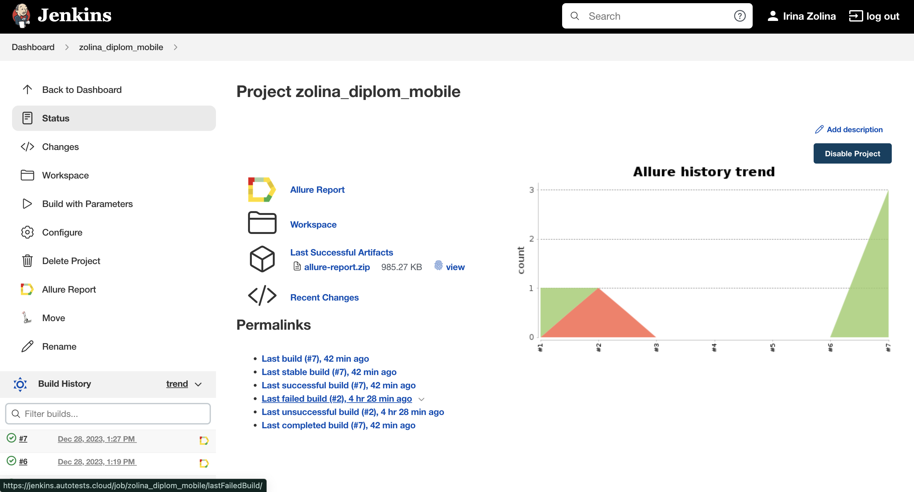
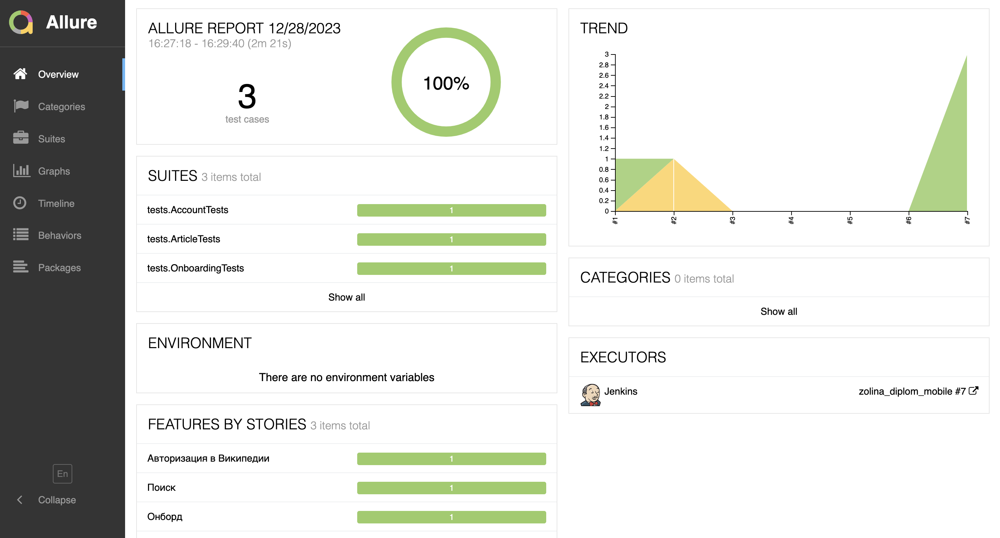
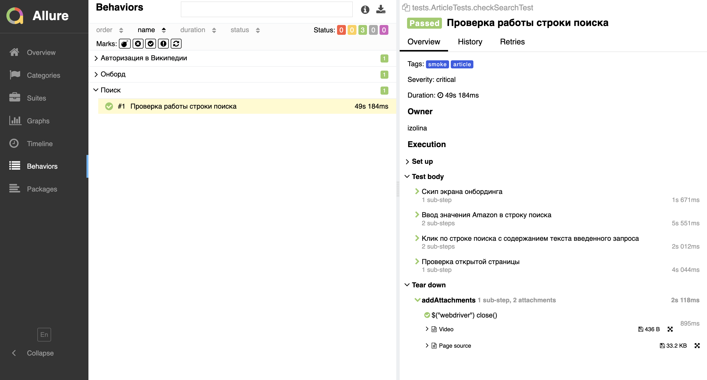

#  Дипломный проект по тестирования мобильного приложения [Wikipedia](https://github.com/wikimedia/apps-android-wikipedia/)

## :open_book: Содержание:

- [Технологии и инструменты](#технологии-и-инструменты)
- [Тест кейсы](#тест-кейсы)
- [Запуск тестов из терминала](#запуск-тестов-из-терминала)
- [Сборка в Jenkins](#сборка-в-jenkins)
- [Пример Allure-отчета](#пример-Allure-отчета)
- [Пример запуска теста в Browserstack](#пример-запуска-теста-в-Browserstack)

## Технологии и инструменты

<p align="center">
<a href="https://www.jetbrains.com/idea/"></a>
<a href="https://www.java.com/"></a>
<a href="https://gradle.org/"></a>
<a href="https://junit.org/junit5/"></a>
<a href="https://github.com/"></a>
<a href="https://developer.android.com/"></a>
<a href="https://appium.io/"></a>
<a href="https://www.browserstack.com/"></a>
<a href="https://allurereport.org/"></a>
<a href="https://www.jenkins.io/"></a>
</p>

## Тест кейсы
- Проверка объектов на странице создания нового аккаунта
- Проверка работы строки поиска
- Проверка текстов на экранах онбординга

## Запуск тестов из терминала

### Локальный запуск тестов

```bash
 gradle clean test -DdeviceHost=emulator
```

### Удаленный запуск тестов

```bash
gradle clean test -DdeviceHost=browserstack
```

При выполнении команды, данные тесты запустятся удаленно в <code>Browserstack</code>

При необходимости также можно переопределить параметры запуска:

```
clean testByTags
-Dtags=${TAGS} 
-DdeviceHost=${DEVICE_HOST} 
```

### Параметры сборки

* <code>TAGS</code> – тэг с которым будут запускаться тесты.
* <code>DEVICE_HOST</code> – переменная определения среды для запуска тестов.

## Сборка в [Jenkins](https://jenkins.autotests.cloud/job/zolina_diplom_mobile/)

Для запуска сборки необходимо перейти в раздел <code>Build with Parameters</code> указать нужный параметр и нажать кнопку <code>Build</code>.

<p align="center">

</p>

После выполнения сборки, в блоке <code>Build History</code> напротив номера сборки появится значок <code>Allure Report</code> кликнув по которому, откроется страница с сформированным html-отчетом.

## Пример [Allure-отчета](https://jenkins.autotests.cloud/job/zolina_diplom_mobile/allure)
### Overview

<p align="center">

</p>

### Результат выполнения теста

<p align="center">

</p>

## Пример запуска теста в Browserstack

К каждому тесту в отчете прилагается видео.

На данном видео выполняется:

- Проверка работы строки поиска

<p align="center">
  
</p>